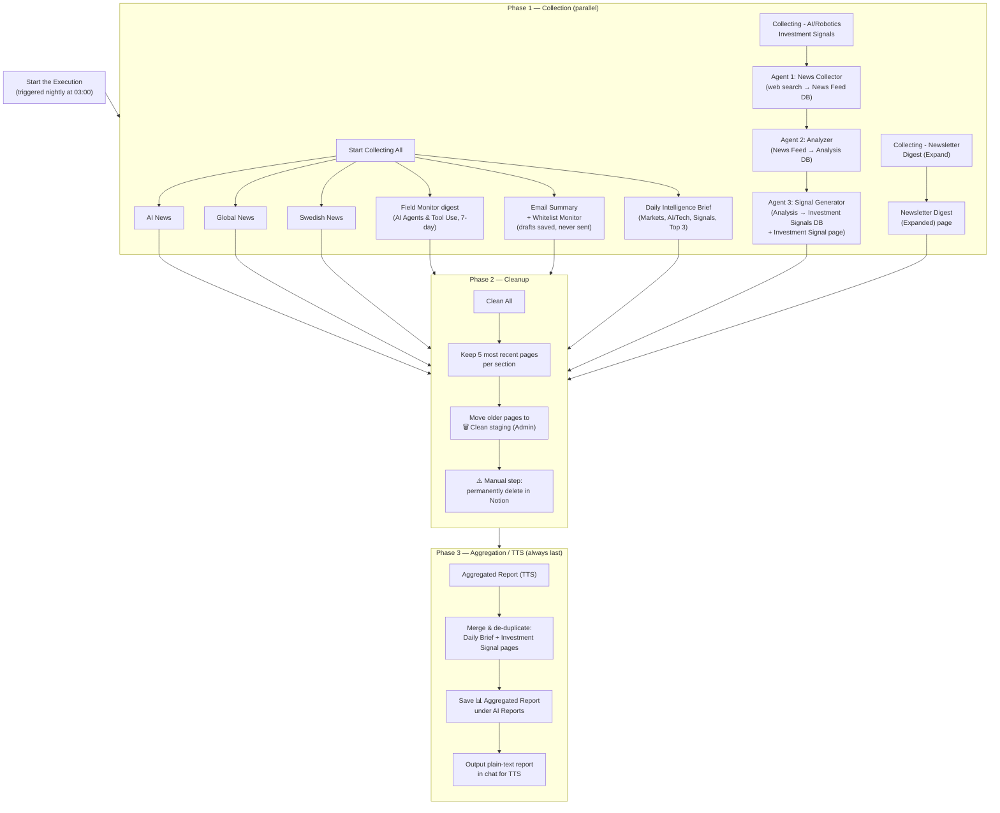

# Execution Flow Diagram

Source: https://app.notion.com/p/37ee3c20a8ee8198a325ec2bf6dbe992

Visual flow for the nightly **Start the Execution** run. See `description.md` for the full written explanation of each step.

